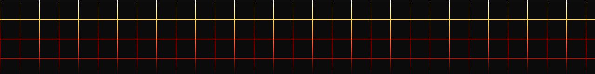

  

  

[![LinkedIn](https://img.shields.io/badge/linkedin-badge?style=for-the-badge&logo=data%3Aimage%2Fsvg%2Bxml%3Bbase64%2CPD94bWwgdmVyc2lvbj0iMS4wIiBlbmNvZGluZz0iaXNvLTg4NTktMSI%2FPg0KPCEtLSBVcGxvYWRlZCB0bzogU1ZHIFJlcG8sIHd3dy5zdmdyZXBvLmNvbSwgR2VuZXJhdG9yOiBTVkcgUmVwbyBNaXhlciBUb29scyAtLT4NCjxzdmcgZmlsbD0iIzAwMDAwMCIgaGVpZ2h0PSI4MDBweCIgd2lkdGg9IjgwMHB4IiB2ZXJzaW9uPSIxLjEiIGlkPSJMYXllcl8xIiB4bWxucz0iaHR0cDovL3d3dy53My5vcmcvMjAwMC9zdmciIHhtbG5zOnhsaW5rPSJodHRwOi8vd3d3LnczLm9yZy8xOTk5L3hsaW5rIiANCgkgdmlld0JveD0iMCAwIDUwNC40IDUwNC40IiB4bWw6c3BhY2U9InByZXNlcnZlIj4NCjxnPg0KCTxnPg0KCQk8cGF0aCBkPSJNMzc3LjYsMC4ySDEyNi40QzU2LjgsMC4yLDAsNTcsMCwxMjYuNnYyNTEuNmMwLDY5LjIsNTYuOCwxMjYsMTI2LjQsMTI2SDM3OGM2OS42LDAsMTI2LjQtNTYuOCwxMjYuNC0xMjYuNFYxMjYuNg0KCQkJQzUwNCw1Nyw0NDcuMiwwLjIsMzc3LjYsMC4yeiBNMTY4LDQwOC4ySDk2di0yMDhoNzJWNDA4LjJ6IE0xMzEuNiwxNjguMmMtMjAuNCwwLTM2LjgtMTYuNC0zNi44LTM2LjhjMC0yMC40LDE2LjQtMzYuOCwzNi44LTM2LjgNCgkJCWMyMC40LDAsMzYuOCwxNi40LDM2LjgsMzYuOEMxNjgsMTUxLjgsMTUxLjYsMTY4LjIsMTMxLjYsMTY4LjJ6IE00MDguNCw0MDguMkg0MDhoLTYwVjMwNy40YzAtMjQuNC0zLjItNTUuNi0zNi40LTU1LjYNCgkJCWMtMzQsMC0zOS42LDI2LjQtMzkuNiw1NHYxMDIuNGgtNjB2LTIwOGg1NnYyOGgxLjZjOC44LTE2LDI5LjItMjguNCw2MS4yLTI4LjRjNjYsMCw3Ny42LDM4LDc3LjYsOTQuNFY0MDguMnoiLz4NCgk8L2c%2BDQo8L2c%2BDQo8L3N2Zz4%3D&logoColor=000000&color=f9f6a7)](https://www.linkedin.com/in/claudia-sobral/)

# Olá, eu sou a Claudia Sobral ✨

Profissional de Dados e BI, especializada em transformar dados brutos em dashboards e insights de negócio que orientam decisões estratégicas.
Domino o ciclo completo de Business Intelligence: modelagem em SQL, limpeza de dados em Python e construção de dashboards em Power BI, aplicando Data Storytelling para traduzir análises complexas em narrativas visuais claras para públicos técnicos e não-técnicos.
Resolver problemas é o meu objetivo e dados é apenas mais uma ferramenta de fazê-lo :)

📍 **Localização:** Rio de Janeiro, Brasil  
🌐 **Portfólio:** [claudiasobral.com](https://claudiasobral.com/) | 💼 **LinkedIn:** [linkedin.com/in/claudia-sobral](https://www.linkedin.com/in/claudia-sobral/) | 📧 **Contato:** [ola@claudiasobral.com](mailto:ola@claudiasobral.com)

---

### 🎓 Certificações & Badges

### 🛠️ Tecnologias & Habilidades

**Linguagens & Manipulação de Dados:**  

**Machine Learning & Analytics:**  

**Nuvem & Boas Práticas:**  

---

### 📌 Projetos em Destaque

* 🎓 **[O Impacto do Gênero em STEM (Microdados do ENEM)](https://github.com/ClaudiaSobral/enem-stem-genero)**  
  *Pipeline de dados de ponta a ponta e modelo preditivo analisando +23M de registros (11GB+). Ingestão otimizada em chunks e formato Parquet (redução de 96,8% no tempo de leitura) com aplicação de CatBoost + SHAP para mensurar barreiras socioeconômicas.*

* 🪙 **[Pipeline de Dados & Dashboard do Bitcoin](https://github.com/ClaudiaSobral/bitcoin-data-and-dashboard)**  
  *Pipeline ETL automatizada em Python para coleta de dados financeiros via APIs REST, armazenamento relacional em SQLite e visualização de indicadores de mercado (SMA, Bandas de Bollinger, ATR) com Plotly.*

* 🏠 **[Modelo Preditivo de Preços Imobiliários (Housing Prices)](https://github.com/ClaudiaSobral/Housing-Prices)**  
  *Estudo preditivo de Machine Learning utilizando análise exploratória de dados (EDA) e regressão linear múltipla para identificar variáveis com maior peso na precificação de imóveis.*

---

### 🎨 Além dos Dados: O Poder do Data Storytelling

Antes de mergulhar na Ciência de Dados, estive envolvida por +5 anos em produções de animação para grandes marcas como **Netflix, Amazon Prime e HBO Max**. 

Essa experiência me trouxe uma vantagem competitiva única em **Data Storytelling**: não apenas construo pipelines ou treino modelos de Machine Learning, mas traduzo datasets complexos em narrativas visuais claras e acionáveis para apoiar a tomada de decisão estratégica.

💬 **Idiomas:** 🇧🇷 Português (Nativo) | 🇺🇸 Inglês (Fluente - C1) | 🇫🇷 Francês (Intermediário - A2)

---

### ☕ Vamos Conversar!

Se quiser trocar uma ideia sobre Ciência de Dados, Machine Learning ou projetos analíticos, prepare um bom café e entre em contato:

* 💼 **LinkedIn:** [/in/claudia-sobral](https://www.linkedin.com/in/claudia-sobral/)
* 🌐 **Site / Portfólio:** [claudiasobral.com](https://claudiasobral.com/)
* 📧 **E-mail:** [ola@claudiasobral.com](mailto:ola@claudiasobral.com)
* ▶️ **YouTube:** [A Garota dos Dados](https://www.youtube.com/@garotadosdados)

---

  

